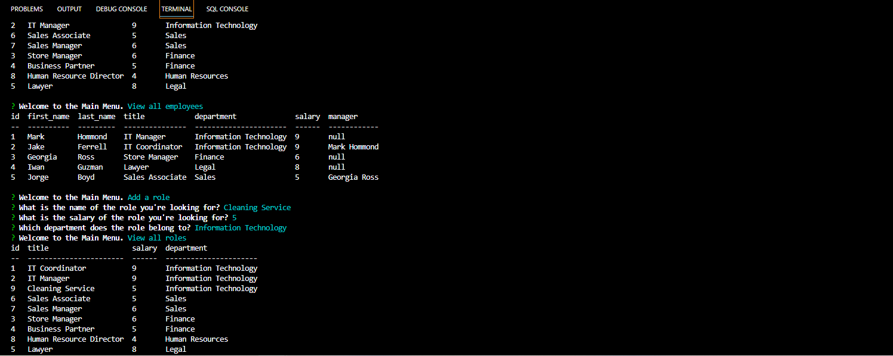

# Employee-Tracker
12 SQL: Employee Tracker

[Deployed Video](https://drive.google.com/file/d/1C8x0uvNlmL2Ao-Y_xrt7p9CxsSG9Y7Ah/view)
 

## Table of Contents
*[Description of Repository](#Repository-Description)
*[User-Story](#User-Story)
*[Contribution-Guidelines](#Contribution-Guidelines)
*[Repositiory-End-Goal-Criterea](#Repositiory-End-Goal-Criterea)
*[License](#License)
*[Contact](#Contact)

# Repository-Description
###### [Back to Table of Contents](#Table-of-Contents)
This is a node app using inquirer and MySQL to help a manager organize their team. This tracker allows users to add, remove, and update employees. You can view teams by manager or department and can easily change an employees' role or manager. This application uses the following npm packages:

* Inquirer package
* MySQL2 package
* console.table package 

## User-Story
### As the Developer
###### [Back to Table of Contents](#Table-of-Contents)
GIVEN a command-line application that accepts user input
WHEN I start the application
THEN I am presented with the following options: view all departments, view all roles, view all employees, add a department, add a role, add an employee, and update an employee role
WHEN I choose to view all departments
THEN I am presented with a formatted table showing department names and department ids
WHEN I choose to view all roles
THEN I am presented with the job title, role id, the department that role belongs to, and the salary for that role
WHEN I choose to view all employees
THEN I am presented with a formatted table showing employee data, including employee ids, first names, last names, job titles, departments, salaries, and managers that the employees report to
WHEN I choose to add a department
THEN I am prompted to enter the name of the department and that department is added to the database
WHEN I choose to add a role
THEN I am prompted to enter the name, salary, and department for the role and that role is added to the database
WHEN I choose to add an employee
THEN I am prompted to enter the employee’s first name, last name, role, and manager, and that employee is added to the database
WHEN I choose to update an employee role
THEN I am prompted to select an employee to update and their new role and this information is updated in the database 

  ## Contribution-Guidelines
###### [Back to Table of Contents](#Table-of-Contents)
none

## Overview: What Was Accomplished!
### Workflow [Back to Table of Contents](#Table-of-Contents)
Created an Employee Traacker so I can manage the departments, roles, and employees in my company so that I can organize and plan my business.

### Screenshots (Building this application)
###### [Back to Table of Contents](#Table-of-Contents)

## Repositiory-End-Goal-Criterea
###### [Back to Table of Contents](#Table-of-Contents)
Stay on Task

## License
MIT
* For more information on license types, please reference this website
for additional licensing information - [https: //choosealicense.com/](https://choosealicense.com/).

## Contact
* Github Username: victor5055
* Github Profile link:(https://github.com/victor5055)
* Email: victor5055@outlook.com

Permission is hereby granted, free of charge, to any person obtaining a copy of this software and associated documentation files (the "Software"), to deal in the Software without restriction, including without limitation the rights to use, copy, modify, merge, publish, distribute, sublicense, and/or sell copies of the Software, and to permit persons to whom the Software is furnished to do so, subject to the following conditions:

The above copyright notice and this permission notice shall be included in all copies or substantial portions of the Software.

THE SOFTWARE IS PROVIDED "AS IS", WITHOUT WARRANTY OF ANY KIND, EXPRESS OR IMPLIED, INCLUDING BUT NOT LIMITED TO THE WARRANTIES OF MERCHANTABILITY, FITNESS FOR A PARTICULAR PURPOSE AND NONINFRINGEMENT. IN NO EVENT SHALL THE AUTHORS OR COPYRIGHT HOLDERS BE LIABLE FOR ANY CLAIM, DAMAGES OR OTHER LIABILITY, WHETHER IN AN ACTION OF CONTRACT, TORT OR OTHERWISE, ARISING FROM, OUT OF OR IN CONNECTION WITH THE SOFTWARE OR THE USE OR OTHER DEALINGS IN THE SOFTWARE.

